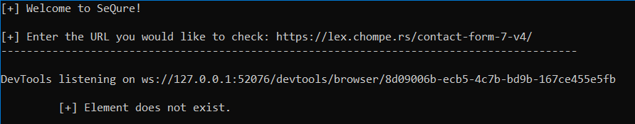
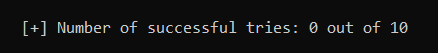

# SeQure: Cross-Site Scripting Vulnerability Tool for WordPress Form Plugins

+ This is a WordPress form plugin vulnerability scanner that works with WordPress web applications that scans the web for cross-site scripting (XSS) vulnerabilities. It is to prevent and assist programmers with making sure they have sanitized and also updated plugins for stronger security for their web application.

## Abstract
Over the years, many web applications are becoming more and more susceptible to being exploited by various vulnerabilities within its code. This is done by programmers not properly sanitizing and checking code that they are using to, specifically, build websites. The website builder, WordPress, for example has a feature to be able to handle “contact form” information. This includes the ability to take in information such as a name, a phone number, email address, etc. However, not all versions of these plugins are deemed safe. There are many WordPress form plugins that allow attackers to enter in cross site scripting (XSS) scripts into these input forms making the attacker able to access user information. To avoid attackers gaining access using XSS scripts, the tool SeQure will allow website users to be able to check their form plugins to make sure that they are safe for further use.

## How To Run in Terminal

The program begins by prompting the user to input a URL that they would like to test. The user can then paste their URL inside of the terminal.

Once the user pastes their URL inside of the prompt, then the source code for SeQure begins to run. SeQure uses an automated testing software called selenium to run the tests. Selenium is able to open a `headless` and `non-headless` option within Selenium. This means that without the headless option of selenium running that the a new automated testing browser will appear on the users screen every time the test is being run. In this way, the user can visibly see the scripts being inputted into the input fields and seeing the button being pressed.

However, with the headless option being used the browser will not open up and it will pretend a browser is being opened and run. The user will be able to see output if an HTML element is found or if the element the code is searching for `Does not exist.` 

In the code itself is a list containing boolean values to determine if the scripts were actually sent or not. If the script was able to send then it is labeled as `True` and stored in the list. At the end of the program, if none of the scripts were able to work then the output would be:

the output above demonstrates if the scripts were not able to work meaning that the field themselves either do not exist entirely and/or the script entered did not work due to input sanitization. If the script is able to send to the owner's email, then the input fields are not sanitized correctly. If this is the case, then the Wordpress user needs to update their plugin to a more recent version of that specific plugin. On the other hand, if the input fields were properly sanitized then that means that the input fields will not allow the script to be sent to the owner making that version of a plugin safe to use.

## For WordPress Plugin Users!

