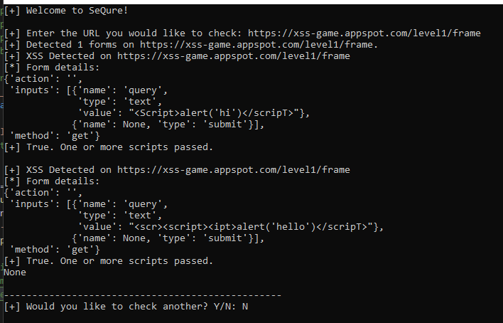

# SeQure

+ This is a web application scanner that scans the web app for specific vulnerabilities and returns a "grade" for their website. It is to prevent and assist programmers with making sure they have sanitized code and stronger security for their web application.

## Overview

Over the years, many web applications are becoming more and more susceptible to being exploited by various vulnerabilities. This is done by programmers not properly sanitizing their code for security purposes and only focusing on funcitonality of their website. Disregarding security, can mess with the functionality of the entire website which is a concern for anyone who intends to use a website. SeQure will scan the entire website looking for specific spots that are vulnerable within a website, test possible scripts, and then output a grade of how safe their website is based on proper sanitation techniques.
Users who utilize this tool will be graded on how many of these test scripts pass. The more scripts that pass, the lower the user's overall grade will be. Within this tool, there will also be either a markdown file (.md) or text file (.txt) holding all of the information that was run within the code: how many vulnerabilities were found, how many scripts passed, and how to sanitize code correctly based off of what vulnerability was found. *This tool specifically focuses on cross-site scripting and SQL injection vulnerabilites.*

## How To Run

The program begins by promtpting the user to input a URL that they would like to test. The user can then paste their URL inside of the terminal.

Once the user pastes their URL inside of the prompt, then the source code for SeQure begins to run. Next, it detect any open forms and tests the scripts on the URL's input form. If the script is able to pass, then it returns an output of what script was passed and returns a value of `True` meaning that the URL input form is vulnerable. However, if the tool detects a form but none of the scripts pass then it will return a value of `False`.

## Grade Rubric

The grader that is built into SeQure will grade the web application in four categories as CVSS ratings: low, medium, high, and critical.

### Low (0.1-3.9)

### Medium (4.0-6.9)

### High(7.0-8.9)

### Critical (9.0-10.0)
