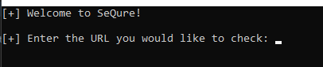

# SeQure

+ This is a WordPress form plugin scanner that works with WordPress web applications that scans the web for specific vulnerabilities. It is to prevent and assist programmers with making sure they have sanitized and also updated plugins for stronger security for their web application.

## Overview

Over the years, many web applications are becoming more and more susceptible to being exploited by various vulnerabilities. This is done by programmers not properly sanitizing and checking the plugin code for security purposes and only focusing on funcitonality of their website. There are many WordPress form plugins that have various updates. However, users are still able to access older, vulnerable versions of most plugins.
Users who utilize this tool will allow them to see on how many of these test scripts pass. Within this tool, there will also be either a markdown file (.md) or text file (.txt) holding all of the information that was run within the code: how many scripts passed. If scripts do pass, then the plugin itself is vulnerable and needs to be removed or the plugin needs to be updated immediately. *This tool specifically focuses on cross-site scripting.*

## Feasibility

## How To Run

The program begins by promtpting the user to input a URL that they would like to test. The user can then paste their URL inside of the terminal.

Once the user pastes their URL inside of the prompt, then the source code for SeQure begins to run. SeQure uses an automated testing software called selenium. Selenium opens up a testing browser, so the user can visibly see the code working. While the browser is up and running, the user will be able to see the script being entered into the input fields. The differences will be if the scripts are going to be able to be sent to the owner then the plugin is vulnerable and the input is not being properly sanitized. If it were properly sanitized, then the plugin would return the error when the script is entered.

